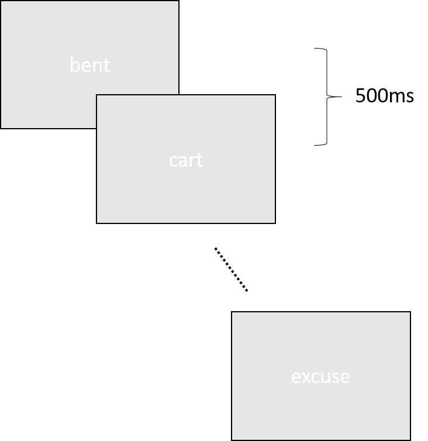
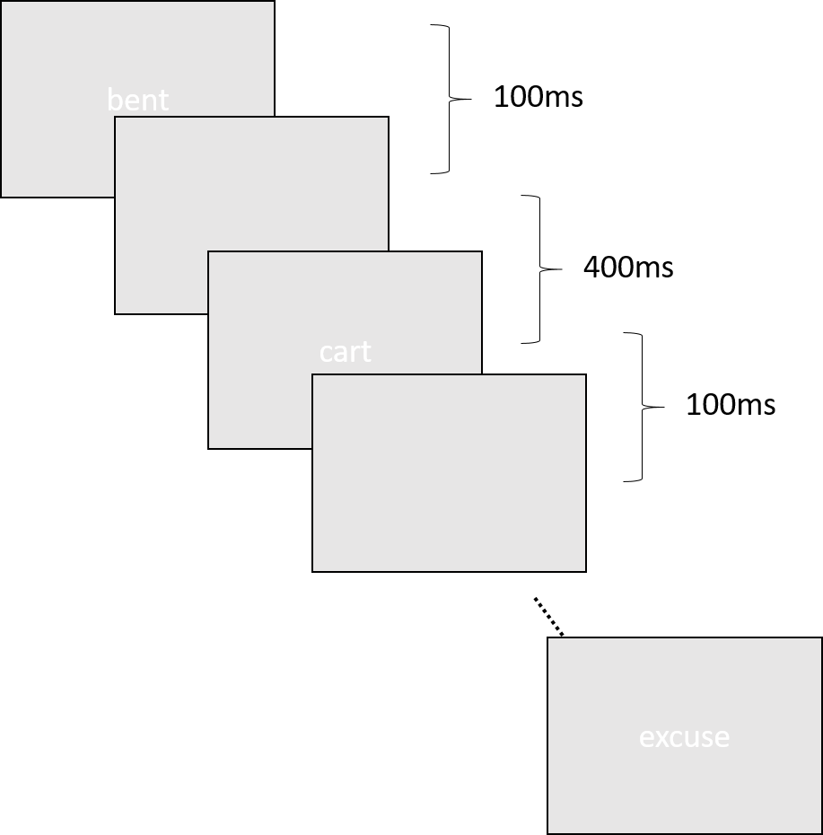

```{r setup, include=FALSE}
knitr::opts_chunk$set(echo = TRUE, eval = FALSE, python.reticulate = FALSE)
```

## Adding PsychoPy interpreter to VS Code

1. Install Python extension
2. Press f1 (or ctrl+shift+p) to open command palette.
3. Type in: Python select interpreter.
4. Choose the psychopy interpreter.

* See this link:
<https://code.visualstudio.com/docs/python/environments>

## Today's goal

* Rewrite the experiment we had last week into PsychoPy.
    + Open up a separate window.
    + Present stimuli on the separate window.
    + Asking input from keyboard.

## Using PsychoPy

* Loading PsychoPy module

``` {python}
import psychopy.visual
```

* This imports the visual module in psychopy. 
* To use the functions/classes in the visual module:

```{python}
window = psychopy.visual.Window()
```

* There is another way of importing module

```{python}
from psychopy import visual

window = visual.Window()
```

## Using PsychoPy

```{python}
window = psychopy.visual.Window()

```

* [psychopy.visual.Window](http://www.psychopy.org/api/visual/window.html#psychopy.visual.Window) is an class (user defined object) which creates a window for psychopy.

* To draw soemthing in PsychoPy

```{python}
hi = psychopy.visual.TextStim(window, text = 'Hello World')
hi.draw()
```

* Everything presented on the screen are Stimulus.
    + [TextStim](http://www.psychopy.org/api/visual/textstim.html#psychopy.visual.TextStim) is one of them.
    + [draw()](http://www.psychopy.org/api/visual/textstim.html#psychopy.visual.TextStim.draw) function draws the stimulus on the **BACK** of the screen.
* After you finished drawing anything, [flip](http://www.psychopy.org/api/visual/window.html#psychopy.visual.Window.flip) the screen to show them.

``` {python}
window.flip()
```

## Wait

``` {python}
import psychopy.core
```

``` {python}
psychopy.core.wait(2.0) # wait 2 seconds
```

* [wait](http://www.psychopy.org/api/core.html#psychopy.core.wait) waits.

## Getting input

```{python}
import psychopy.event
```

* Every input is an [event](http://www.psychopy.org/api/event.html), including:
    + mouse movement
    + keyboard press
    + joystick
    
* At the moment, we just want keyboard input
```{python}
response = psychopy.event.waitKeys()
```

* [waitKeys()](http://www.psychopy.org/api/event.html#psychopy.event.waitKeys) waits for a key input.

## Surprised Home Work!

* At the moment, each stimulus is displayed for 500ms, and there is no interval between stimulus offset and onset.

<div class="columns-2">
  ```{r, out.width = "320px", eval = TRUE, echo = FALSE}
  
  ```
  
  ```{r, out.width = "320px", eval = TRUE, echo = FALSE}
  
  ```
</div>

* Your job is adding a blank screen between stimuli.