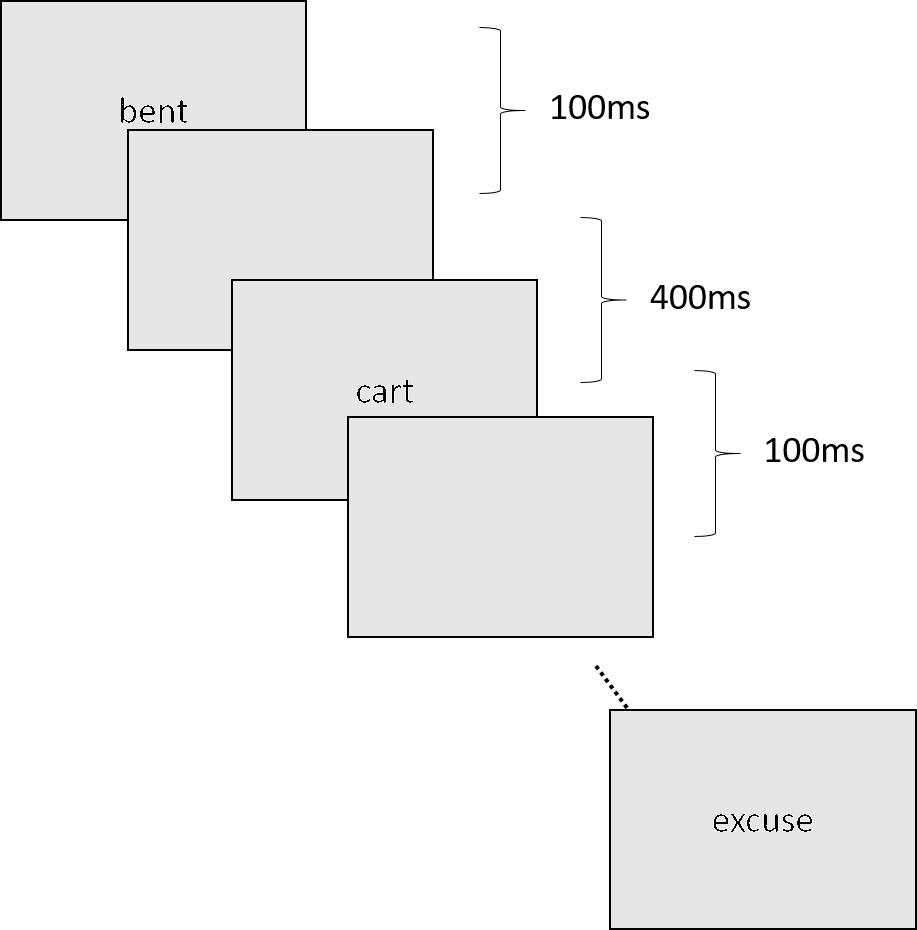

```{r setup, include=FALSE}
knitr::opts_chunk$set(echo = TRUE, eval = FALSE, python.reticulate = FALSE)
```

## Previous HomeWork

- Drawing blank screen
```{python}
    window.flip() # refresh the window
    psychopy.core.wait(ISI) # inter-stimuli-interval
```
1. But where to put it.
    + After the stimulus display, of course.
    

2. Identifying which part of the code is responsible of presenting the stimulus.

```{python}
for i in range(setsize):
    stim = psychopy.visual.TextStim(window, text = stimuli[i])
    stim.draw()
    window.flip()
    psychopy.core.wait(display_duration)
```

- Considering adding a comment if you can't identify it.

## Level of Processing

- Typical long-term memory study by CVraik & Lockhart (1972)


- Show a long list of words
- After each word display, participants are asked to `process` the word, e.g., 
    + Phonemic
    + Categorical
    + Sentence
- Later there will be a recall/recognition task.

## Level of Processing

- Let's do a short-term memory version.
- What we have now:

```{r, out.width = "320px", eval = TRUE, echo = FALSE}
  
```
- Add recording after each stimulus display

## Level of Processing

```{python}
response = psychopy.event.waitKeys(keyList = ['o', 'n'])
```

- Previously, we used [waitKeys]<http://www.psychopy.org/api/event.html#psychopy.event.waitKeys>.
- Let's try it.