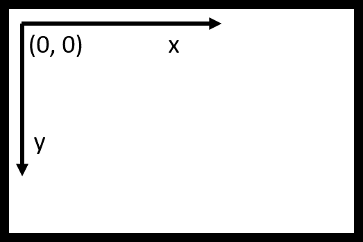
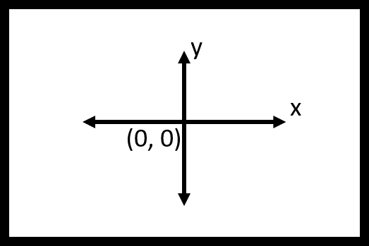
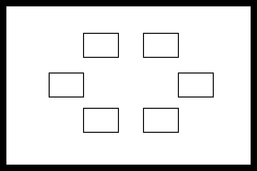

```{r setup, include=FALSE}
knitr::opts_chunk$set(echo = TRUE, eval = FALSE, python.reticulate = FALSE)
```

## Exercise

- Using [list](https://docs.python.org/2/tutorial/datastructures.html) to store the result
```{python}
result = [] # setup an empty list to store the result
for i in range(setsize):
    ...
    ...
    result.append(response[0]) #attach the response to the end of the list
    # result.append((response[0], reaction_time)) # appending a tuples
```

## Stimuli

- There are many other [stock stimuli](http://www.psychopy.org/api/visual.html) in PsychoPy. 
- Today is about [shapes](http://www.psychopy.org/api/visual/shapestim.html#psychopy.visual.ShapeStim).

- However, let's look at [Window](http://www.psychopy.org/api/visual/window.html#psychopy.visual.Window) first.

## Window

- Originally, window is setup like this:

```{python}
window = psychopy.visual.Window()
```

- However, I typically open the window as:
```{python}
window = visual.Window(
    units = 'height',
    fullscr=True,
    color = (200, 200, 200),
    colorSpace = 'rgb255', 
    winType = 'pyglet',
    screen = 0
)
```
- What does those mean?
- See code: open_window.py

## Units

- [Units for the window and stimuli](http://www.psychopy.org/general/units.html#units)
- Pixels
- Height units
    - One unit is equal to screen height.
- Normalized units
    - Both x and y axis are scaled to 1.
    - Totally screw up drawing circles.
    
## Coordinate System

<div class="columns-2">
Unlike the traditional computer coordinate system:
<center>
```{r, out.width = "450px", eval = TRUE, echo = FALSE}

```
</center>

PsychoPy uses coordinate system like this:
<center>
```{r, out.width = "450px", eval = TRUE, echo = FALSE}

```
</center>
</div>

## Drawing Empty Frames
```{r, out.width = "800px", eval = TRUE, echo = FALSE}

```

## Drawing Empty Frames

- Drawing one frame
- [Rect](http://www.psychopy.org/api/visual/rect.html#psychopy.visual.Rect)

```{python}
rect = psychopy.visual.Rect(window, width = 0.2, height = 0.2)
rect.draw()
```

- Tuning more [knobs](http://www.psychopy.org/api/visual/shapestim.html#psychopy.visual.ShapeStim)
```{python}
rect = psychopy.visual.Rect(
    window,
    width = 0.2,
    height = 0.2,
    lineWidth = 5, # yes, 5.
    lineColor = (0, 0, 0),
    lineColorSpace = 'rgb255',
    fillColor = None
)
```

## Drawing Empty Frames

- Predefine the frame positions.
- Draw multiple frames one by one.
- Rect3.py

## Mouse Clicks

- [Mouse](http://www.psychopy.org/api/event.html#psychopy.event.Mouse)
- [isPressedIn](http://www.psychopy.org/api/event.html#psychopy.event.Mouse.isPressedIn)
- Rect_Mouse.py

## 