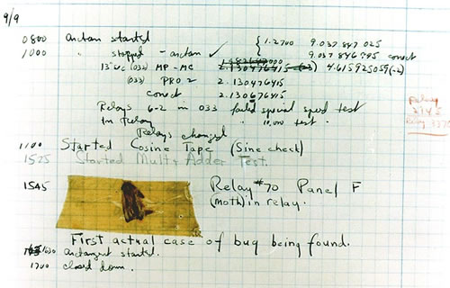

```{r setup, include=FALSE}
knitr::opts_chunk$set(echo = TRUE, eval = FALSE, python.reticulate = FALSE)
```


## Last Week

- Now, we only present 12 trial.
- Present multiple trials (48).
- The conditions of those trials are random but each codition occurs 4 times.

```{python}
# actual experiment trials
condition_indexes = numpy.arange(48)
condition_indexes = condition_indexes % 12
```

## Debugging

<center>
```{r, out.width = "500px", eval = TRUE, echo = FALSE}

```
</center>

- Other than the actual bugs, there are typically two types of bugs:
    - The bug which gives you error message
    - The bug gives you zero warning. You might not even aware it exists.
    
## Bug with Error Message

- Typical error message
```
Traceback (most recent call last):
  File "c:/Users/user/Documents/GitHub/PsychoPy2018/Codes/Week9_debugging/sternbergs_randomizor.py",
  line 90, in <module>
    trial_info = getTrialInfo(condition_index, word_list)
  File "c:/Users/user/Documents/GitHub/PsychoPy2018/Codes/Week9_debugging/sternbergs_randomizor.py",
  line 26, in getTrialInfo
    trial_info['probe'] = trial_info['stimuli'][trial_info['serial_position']-1]
IndexError: index 3 is out of bounds for axis 0 with size 3
3.4439  ERROR   avbin.dll failed to load. Try importing psychopy.visual
  as the first library (before anything that uses
scipy)
  and make sure that avbin is installed.
3.4553  WARNING         Monitor specification not
found. Creating a temporary one...
```

## Error Message

- Message from Python
```
Traceback (most recent call last):
  File "c:/Users/user/Documents/GitHub/PsychoPy2018/Codes/Week9_debugging/sternbergs_randomizor.py",
  line 90, in <module>
    trial_info = getTrialInfo(condition_index, word_list)
  File "c:/Users/user/Documents/GitHub/PsychoPy2018/Codes/Week9_debugging/sternbergs_randomizor.py",
  line 26, in getTrialInfo
    trial_info['probe'] = trial_info['stimuli'][trial_info['serial_position']-1]
IndexError: index 3 is out of bounds for axis 0 with size 3
```

- Message from PsychoPy
```
3.4439  ERROR   avbin.dll failed to load. Try importing psychopy.visual
  as the first library (before anything that uses
scipy)
  and make sure that avbin is installed.
3.4553  WARNING         Monitor specification not
found. Creating a temporary one...
```

## Error Message

- Python manual page about [error messages](https://docs.python.org/2.7/tutorial/errors.html):
    - Syntax error
    - [Exceptions](https://docs.python.org/2.7/library/exceptions.html)
    
- Syntax error is easy to fix.
    - Fix the line (or the previous line).
    - Linting.
    
- Exceptions is a bit more difficult
    - Mistake is normally not happened at where the error occured.
    - Read the message
    
## Error Message

Debug1.py
```
IndexError: index 3 is out of bounds for axis 0 with size 3
```

- I tried to access the 4th element but there was only three.
- Look at the lines where I initiated the array

## Error Message

Debug2.py

```
IOError: [Errno 2] No such file or directory: 'WordList.txt'
```

- This is as literal as it could be.
- Make sure you have the right pathing.

## Bugs without Error Messages

- The program works, but it doesn't work the way you intended.
- Before debugging:
    - Make sure you are using window mode for PsychoPy.
    
- Try to track to the source of misalignment.
- Using the debugging tool.

## Bugs You Don't Even Know Exist

- Good luck.

## PsychoPy Related Bugs

- IO error which you don't know it happened.
    - PsychoPy stucked at creating stimulus.
    - PsychoPy ate your IO output (e.g., save to data file).
- Input Buffer
    - Getting the input from previous responses.
    - Buffer stopped responding.